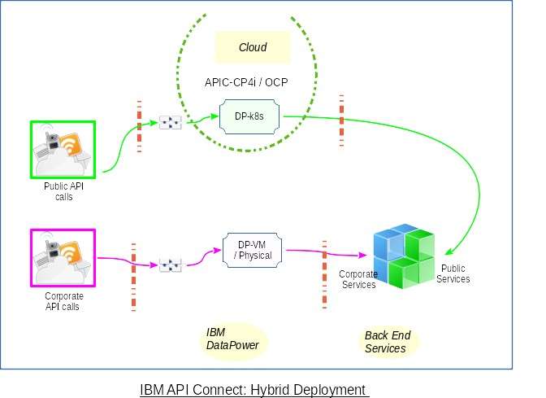
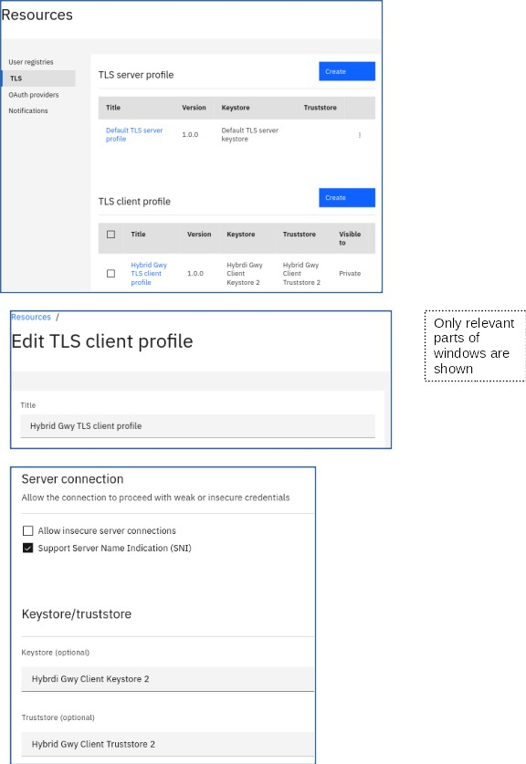
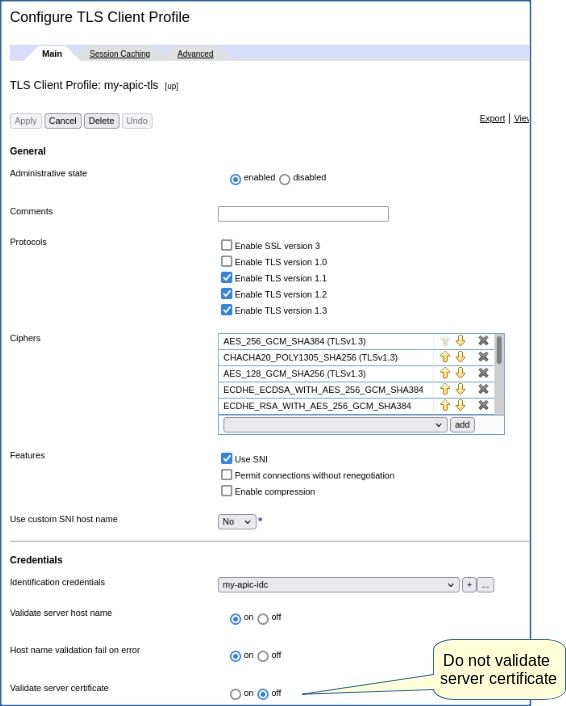
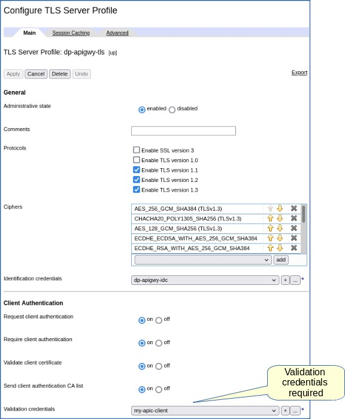
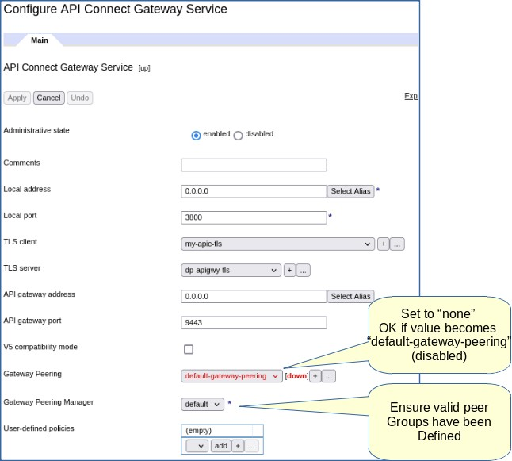

# IBM API Connect  
> ## TLS for IBM API Connect & Hybrid DataPower Gateways  
>  Ravi Ramnarayan, Toufiq Adnan   
>  &copy; IBM v1.6  2021-07-12    

Enterprise IT spans platforms such as Redhat Openshift, IBM CloudPak, cloud vendor Kubernetes and on premises infrastructure. IBM API Connect deployments are often hybrid with DataPower gateways on platforms or geographies different from API Connect components.

This document draws from [Setting up certificates for a gateway](https://www.ibm.com/docs/en/api-connect/10_reserved_instance?topic=reserved-setting-up-certificates-gateway), other IBM publications and our experience.

### Goal     
Highlight TLS settings in API Connect and DataPower to create API Gateways in hybrid deployments. [Registering a gateway service](https://www.ibm.com/docs/en/api-connect/10.0.1.x?topic=topology-registering-gateway-service) on DataPower VM (or physical) appliance from API Connect on CP4i is the task at hand.  



TLS is just one aspect of an API Gateway. Please refer to [Configuring the API Connect Gateway Service](https://www.ibm.com/docs/en/datapower-gateways/10.0.1?topic=connect-configuring-api-gateway-service) for other aspects such as Peering Instances, Peering Manager and Configuration Sequence.

The diagram portrays a split in traffic between DataPower on the cloud and DataPower VM on premises. The illustration is just one among many ways to channel API traffic.  

### Target Audience    
IT professionals with experience in Linux, OpenSSL, IBM API Connect and IBM DataPower.

### Certificates, keys & TLS  
We walk through steps to generate certificates and keys to illustrate the role of TLS profiles.  
#### Custom root CA   
Create a custom root Certificate Authority (CA).  
  > You could use public, corporate CA or third-party certificate authorities (such as *Digicert* or *Let'sEncrypt*) as a central CA. Check with your corporate security team.   

- Create a CA private key:  
```
openssl genrsa -out my-ca-prikey.pem 2048
```  
- Create a CA certificate and provide inputs to the prompts according to your organization's needs.   
```
openssl req -new -x509 -days 3650 -key my-ca-prikey.pem -out my-ca-cert.pem  
```  

#### Server key and certificate (for trust)  

Generate the certificate which the server (DataPower) presents to the client (API Connect API Manager). The server key and certificate establish one-way trust, enabling API Manager to view DataPower as "trustworthy."

- Generate a new private key for the server:
```
openssl genrsa -out dp-apigwy-prikey.pem 2048
```
- Generate a new certificate signing request (CSR) which uses the private key from the previous step:  
```
openssl req -new -key dp-apigwy-prikey.pem -out dp-apigwy.csr
```
Provide inputs to the prompts according to your organization's needs.
> **Note**: Ensure the "common name" is an exact match of the DataPower Gateway's FQDN.  

- Generate the server certificate which with the CSR:  
```
openssl x509 -req -in dp-apigwy.csr -CA my-ca-cert.pem -CAkey my-ca-prikey.pem -out dp-apigwy-cert.pem -CAcreateserial -days 265 -sha256
```
- Bundle the server certificate with intermediate and CA certificates:  
```
cat dp-apigwy-cert.pem my-ca-cert.pem > dp-apigwy-cert-bundle.pem  
```
> **Note**: The sequence is critical: Leaf certificate + intermediates (ordered by precedence) + CA.


#### Client key and certificate (for authentication)  

Create the certificate which allows the API Manager to authenticate with the gateway server.

- Generate the client key:
```
openssl genrsa -out my-apic-prikey.pem 2048
```
- Generate a certificate signing request with the client key from the previous step:
```
openssl req -new -key my-apic-prikey.pem -out my-apic.csr
```
- Generate the client certificate:
```
openssl x509 -req -in my-apic.csr -CA my-ca-cert.pem -CAkey my-ca-prikey.pem -out my-apic-cert.pem -CAcreateserial -days 265 -sha256
```

- Bundle the client certificate with intermediate and CA certificates:  
```
cat my-apic-cert.pem my-ca-cert.pem > my-apic-cert-bundle.pem  
```  

> **Note**: The sequence is critical: Leaf certificate + intermediates (ordered by precedence) + CA.


#### API Connect TLS
- Create a new Keystore with `my-apic-prikey.pem` & `my-apic-cert-bundle.pem`  
- Create a new Truststore with `my-ca-cert.pem`  
- Create a new Client TLS with the new keystore & truststore
  - *Allow insecure server connections* should be disabled (default)  


  


#### DataPower Gateway TLS   
Create *TLS Client Profile* and *TLS Server Profile* in the domain designated for the API Connect Gateway Service. Make sure you switch to the `apiconnect` domain (typical name used in IBM documents).  

##### TLS Client Profile  
- Create *Crypto Key* `my-apic-key`  
  - *File*: `my-apic-prikey.pem`  
- Create *Crypto Certificate* `my-apic-cert`  
  - *File*: `my-apic-cert-bundle.pem`  
- Create *Crypto Identification Credential* `my-apic-idc`  
  - *Crypto Key*: `my-apic-key`  
  - *Certificate*: `my-apic-cert`  

- Create *TLS Client Profile* `my-apic-tls`  
  - *Features*  
    Defaults for all settings
  - *Use custom SNI host name*: `No` (default)  
  - *Credentials*  
    - *Identification credentials*: `my-apic-idc`  
    - *Validate server host name*: `on`  
    - *Host name validation fail on error*: `on`  
    - *Validate server certificate*: `off` (default)  




##### TLS Server Profile  

- Create *Crypto Key* `dp-apigwy-key`  
  - *File*: `dp-apigwy-prikey.pem`  
- Create *Crypto Certificate* `dp-apigwy-cert`  
  - *File*: `dp-apigwy-cert-bundle.pem`  
- Create *Crypto Identification Credential* `dp-apigwy-idc`  
  - *Crypto Key*: `dp-apigwy-key`  
  - *Certificate*: `dp-apigwy-cert`  


- Create *TLS Server Profile* `dp-apigwy-tls`  
  - *Identification credentials*: `dp-apigwy-idc`  
  - *Client Authentication*  
    - Enable *Request client authentication*  
    - Enable *Require client authentication*  
    - Enable *Validate client certificate*  
    - Enable *Send client authentication CA list*  
    - *Validation credentials* `my-apic-client`  
      - *Certificates*: `my-apic-cert`  
      - *Certificate Validation Mode*: `Match exact certificate or immediate issuer`  
      - Leave other settings at defaults  




### DataPower API Connect Gateway Service  
Create or modify the API Connect Gateway Service in the `apiconnect` domain.

- *Local address*: `0.0.0.0` (or specific interface)  
- *Local port*: `3000` (or your choice)  
- *TLS client*: `my-apic-client`  
- *TLS server*: `dp-apigwy-tls`  
- *API gateway address*: `0.0.0.0` (or specific interface)  
- *API gateway port*: 443 (or another port)  
- *Gateway Peering*: `none`  
- *Gateway Peering Manager*: `default` (or your definition)  
- *User-defined policies*: (empty)  
  You can add user defined policies at a later date.


