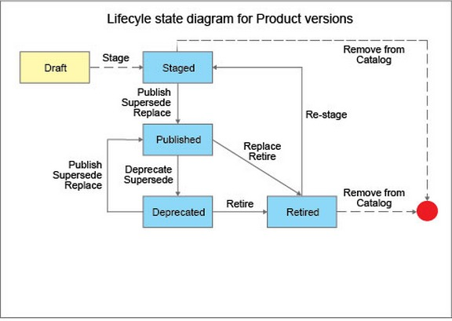
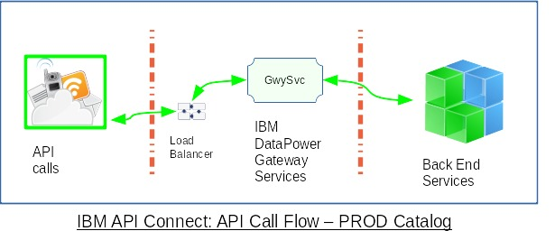
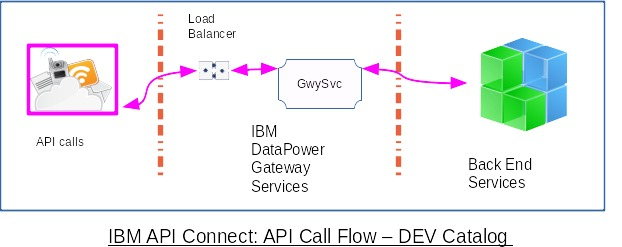
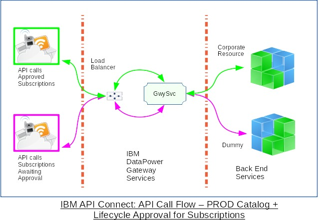
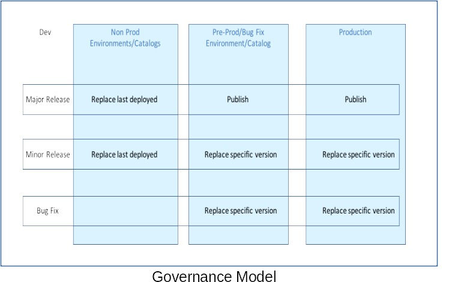

# IBM API Connect
> ## Governance Models & Version Control for API Products
>  Ravi Ramnarayan  
>  &copy; IBM v1.5  2021-04-20    

## Goals  
  - Ensure business continuity while publishing new versions of API Products  
  - Control consumer subscriptions to API Products  
  - Allow API provider teams to develop and test API quickly  
### Collateral effects   
  - Deprecate and Retire API Products gracefully  

## API Product Lifecycle  
The diagram below is advertisement to lead you to the core of API management [The Product lifecycle](https://www.ibm.com/docs/en/api-connect/10.0.1.x?topic=products-product-lifecycle).  

You are familiar with publishing API Products. You may not have looked at Deprecate and Retire while racing towards implementation. In addition to explicit Deprecation, you can do the same implicitly by [Superseding a Product with another Product](https://www.ibm.com/docs/en/api-connect/10.0.1.x?topic=product-superseding-another). Similarly, [Replacing a Product with another Product](https://www.ibm.com/docs/en/api-connect/10.0.1.x?topic=product-replacing-another) will Retire the existing API Product.
> **Note**: *[Replacing a Product with another Product](https://www.ibm.com/docs/en/api-connect/10.0.1.x?topic=product-replacing-another)* could be a new version of the same Product or a completely different Product.  

## API Connect options  
You can configure API Connect (APIC) to suit your needs.  

#### Do you want strict version control for API Products?  
[Creating and configuring Catalogs](https://www.ibm.com/docs/en/api-connect/10.0.1.x?topic=catalogs-creating-configuring) contains steps to enable *Production Mode*. Once enabled, you must publish new versions of API Products. You will not be able to publish API Products with the same version number as existing products.  

> **Note**: You can enable **Production Mode** for catalogs even in non production environments, if you want to enforce versions for API Products.  

#### Do you want API providers to develop and test API quickly?  
If you do not enable **Production Mode** for a catalog, API developers might find it easier to publish new iterations.  

  

> **Note**: You can disable **Production Mode** for catalogs even in production installations, if you do not want to enforce versions for API Products.

#### Do you want to control consumer access to corporate resources?  
[Managing the application lifecycle](https://www.ibm.com/docs/en/api-connect/5.0.x?topic=apis-managing-application-lifecycle) is available in APIC v5. If you have used this feature in APIC v5, you can continue to use it with API Connect *v5 compatible* (v5c) gateway services.

**Orange** API calls from consumer application with approved subscriptions reach the corporate resource. **Blue** API calls from subscriptions without approvals receive response from a dummy endpoint. You will have to encode logic in the gateway script to test the context variable *client.app.lifecycle-state* and direct the request to the appropriate endpoint.

> **Note**: Though Application Lifecycle is not fully documented for the new *API Gateway* service, the context variable `client.app.lifecycle-state` carries `PRODUCTION` or `DEVELOPMENT` when *Application Lifecyle* is enabled for the Catalog.   

## Versions for API Products & API definitions  
### Governance Model  
The Governance Model recommends operations to effect changes and guidelines to assign versions.
- The *Version* aspect applies to API Definitions and API Products  
  If you want to enforce versions you should enable **Production Mode** for the Catalogs in the Production or PreProd environments. You might want to disable **Production Mode** in lower environments to allow free rein to API developers.  
- The *Operations* aspect applies to API Products  
  The Operation comprises the publish verb and associated options. You should compose and validate the command line before automating it in a pipeline. The Governance Model does not show an operation for *Bug Fix* in *Non Prod*. You might wish to use the operation *Replace last deployed* similar to *Major/Minor Release*.  

>**Note**: The Governance matrix is an approach which you should modify to suit your needs.  

  - **Major Release**: Increment the major segment of the version for *API breaking* changes such as changes to API endpoints, invocation parameters or payload syntax. For example, change the version from 1.1.4 -> 2.0.0. The new version of the API could be be published to the UAT and PROD catalogs with subscriptions migrated later. Once all the subscriptions are migrated, the older version of the API should be retired. The sequence of operations could be:
    - Publish v2.0.0  
    - Deprecate v1.1.4  
    > *Note*: Publish **supersede** combines *publish* and *deprecate* in one operation.
    - Migrate subscriptions from v1.1.4 to v2.0.0  
    - Retire v1.1.4  

  You can send email notices to consumers to keep them informed.  

  - **Minor Release**: Increment the minor segment of the version for *non-breaking* changes such as an optional calling parameter. For example, change the version from 1.0.0 -> 1.1.0. You can replace the old version with the new, migrate subscriptions and retire the old version in single operation.  
  - **Bug Fix**: For bug fixes and/or patches to the API implementation which do not affect the API interface, you may increment the last segment in the version.  

### API, API Products & Versions
API and API Products have different life cycles. The table below illustrates an approach. You can assign the version numbers according to your organizations practices.

  |  | API Product 1.0.0 | API Product 1.1.0 | API Product 2.0.0 | Notes |  
  | ---- | :---: | :---: | :---: | ---- |    
  | API-a | 1.0.0 | 1.0.0 | 1.0.1 | One bug fix change to API-a |     
  | API-b | 1.0.0 | 1.1.0 | 1.1.0 | One minor change to API-b |  
  | API-c | 1.1.0 | 1.2.0 | 2.0.0 | Minor & major changes to API-c |    
  | API-d | n/a | n/a | 3.1.0 | API-d is new to Product |     

**API Version**  
API Definitions exist within a Provider Organization. See [API Connect concepts](https://www.ibm.com/docs/en/api-connect/10.0.1.x?topic=overview-api-connect-concepts). API Connect allows you to have multiple versions of the same API which is typical during transitions. During steady states, you should try to have only one version of an API within a Provider Organization.  

  >**Note**: API and API Definition are synonymous. API belong to a Provider Organization and could be used in zero or many API Products.  

#### Should the API URI contain the version number?  
API Connect allows you to implement API URI according to your corporate standards. There are several articles on this topic: Some *Yes*, some *No-No* and a few fence straddlers. A small sample of articles:

- [Best Practices for Versioning REST APIs - Better Programming - Medium](https://medium.com/better-programming/best-practices-for-versioning-an-api-for-rest-apis-530a9398f311)  
- [REST API versioning for Azure DevOps Services (and TFS) - Azure DevOps | Microsoft Docs](https://docs.microsoft.com/en-us/azure/devops/integrate/concepts/rest-api-versioning?view=azure-devops)  
- [REST API Versioning - Is There a Right Answer? - DZone Integration](https://dzone.com/articles/rest-api-versioning-is-there-a-right-answer)  
- [rest - Best practices for API versioning? - Stack Overflow](https://stackoverflow.com/questions/389169/best-practices-for-api-versioning#398564)  

#### I do not like version numbers in the API URI because my consumers will be forced to make changes when I bump the version number. What can API Connect do for me?  

API Connect helps you provide a smooth experience for your consumers. You can implement API URI without version numbers and publish new versions as long as you *require consumers to subscribe to plans*. API Connect will direct the consumer invocations based on the Subscription ClientId. Consider the following scenario:  

- ***api:v1*** & ***api:v2*** share the same API name and URI (base path) which does not contain the version number  
- ***api:v1*** is in product ***product:v1***, ***api:v2*** is in product ***product:v2***  
- both products are in the same Provider Organization & Catalog  
- both products are active and require subscriptions to plans  
- both ***api:v1*** & ***api:v2*** require *ClientId* in the HTTP header  
- ***consumer-app-1*** subscribes to ***product:v1-plan***, ***consumer-app-2*** subscribes to ***product:v2-plan***  

>***Q***: Will calls from ***consumer-1*** reach ***api:v1*** & calls from ***consumer-2*** reach ***api:v2*** ?    
>***A***: Yes & Yes.  
>***Q***: Really, even though the plan names are the same?  
>***A***: Yes. ***api:v1*** & ***api:v2*** have different Client ID's which are tied to different subscriptions.  

Yes, this is hard to believe. I had to prove it to myself. Should you?
- Clone ***api:v1*** to ***api:v2***  
  Invoke a back end service which delivers a different result
- Clone ***product:v1*** to ***product:v2***   
  Relate ***product:v2*** to ***api:v2***  
- Publish both products to the same Gateway Service    
  >**Note**: Both products offer the same Paths and Operations  

- Subscribe ***consumer-app-1*** to ***product:v1-plan***  
- Subscribe ***consumer-app-2*** to ***product:v2-plan***    
- Invoke the each API with the appropriate app Client ID  
  Do you see results from two different back end services?  
  >**Note**: If you clone (copy) ***api:v1*** to ***api:v2*** and use the API Designer Test feature, calls will go to ***api:v1*** as the Client ID is still the same. To avoid this problem, publish ***api:v2***, create a new consumer application and use an external tool such as Postman with the new consumer app Client ID.  

## Lifecycle mechanics  
Let's walk through a few scenarios and illustrate commands which can be used for DevOps in Production. The scenarios below traverse Production and Staging environments. You are likely to have different settings in each environment. For example, credentials and back end services are likely to be different in Production and lower installations. You should ensure the promotion processes accommodate the differences.  

### Scenario A  

  | Env | Catalogs | API Products | API Definitions | Subscriptions |  
  | :---: | :---: | :---: | :---: | :---: |    
  | Production | ProdMode-Enabled | Version Reqd | Version Reqd | Required |     
  | Staging | ProdMode-Enabled | Version Reqd | Version Reqd | Required |     
  | Development | ProdMode-Disabled | Version Opt. | Version Opt. | Optional |     

#### Pro  
- Enforces version control for API Products & Definitions in Production  
- Enables rate limits based on Subscription ClientId in Production   
- Allows API developers freedom to create, publish and test API quickly  

#### Contra  
- Version control for API Definitions and API Products is confusing   
  API Products & Definitions travel on separate tracks which can intersect. For example, you might create a new version of an API Definition. When you include the new API version in an existing Product, you should assign a new version to the API Product.  
- Assigning version numbers is tricky  
  API developer teams have to reach consensus on the practice of assigning version numbers.  

### Scenario B  

  | Env | Catalogs | API Products | API Definitions | Subscriptions |  
  | :---: | :---: | :---: | :---: | :---: |    
  | Production | ProdMode-Disabled | Version Opt. | Version Opt. | Required |     
  | Staging | ProdMode-Disabled | Version Opt. | Version Opt. | Required |     
  | Development | ProdMode-Disabled | Version Opt. | Version Opt. | Optional |     

#### Pro  
- Enables rate limits based on Subscription ClientId in Production   
- Allows API developers freedom to create, publish and test API quickly in all environments including Production  

#### Contra  
- Does not enforce version control for API Products & Definitions in Production  
  Lack of version control can lead to problems. The situation can become complex if some API developer teams decide to use versions.  

### Scenario C  

  | Env | Catalogs | API Products | API Definitions | Subscriptions |  
  | :---: | :---: | :---: | :---: | :---: |    
  | Production | ProdMode-Disabled | Version Opt. | Version Opt. | Optional |     
  | Staging | ProdMode-Disabled | Version Opt. | Version Opt. | Optional |     
  | Development | ProdMode-Disabled | Version Opt. | Version Opt. | Optional |     

#### Pro  
- Allows API developers freedom to create, publish and test API quickly in all environments including Production  

#### Contra  
- Does not enforce version control for API Products & Definitions in Production  
  Lack of version control can lead to problems. The situation can become complex if some API developer teams decide to use versions.  
- Cannot apply rate limits based on Subscription ClientId in Production   
  You could enforce rate limits through other features of DataPower.  

## Summary
- IBM API Connect supports the API Product Lifecyle and helps you tailor different Governance Models for Production & non production installations.  
- IBM API Connect gives you the option to design your API without embedding the *version number* in the URI. You could include the *version number* in the URI if it suits your business practice.  

### Next Step -- DevOps  
In a future article, we will present how you could manage API Products, Plans and Consumer Subscriptions at scale using DevOps.
